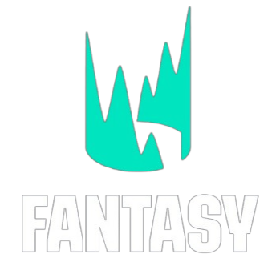

<p align="center">
  <a href="https://lecfantasy.es" target="_blank">
    
  </a>
</p>

<p align="center">
  
  
  
  
</p>

## LEC Fantasy

**LEC Fantasy** es una aplicación web desarrollada con **Laravel 12**, **PHP 8.2** y **Vite** que permite gestionar una liga fantasy basada en la **LEC (League of Legends European Championship)**.

El proyecto incluye:
- Backend desarrollado en **Laravel**
- Frontend con **Vite + TailwindCSS**
- Sistema de ligas, usuarios, equipos, mercado y administración
- Despliegue real en producción sobre **Raspberry Pi 4**

🌐 Producción: **https://lecfantasy.es**

---

## Requisitos previos

Antes de poner en marcha el proyecto, asegúrate de tener instalado:

- **PHP** >= 8.2
- **Composer**
- **Node.js** y **npm**
- **MySQL** o **MariaDB**
- **Apache** (o XAMPP en entorno local)
- Opcional: **Git** para clonar el repositorio

---

## 1. Clonar el proyecto

Clona el repositorio oficial y accede a la carpeta:

```bash
git clone https://github.com/EdgarSole/Lec-Fantasy.git
cd Lec-Fantasy
2. Crear la base de datos

Crea una base de datos en MySQL llamada lec_fantasy:

CREATE DATABASE lec_fantasy CHARACTER SET utf8mb4 COLLATE utf8mb4_unicode_ci;

3. Configuración del archivo .env

Copia el archivo de ejemplo:

cp .env.example .env


Edita el archivo .env y configura la conexión a la base de datos:

DB_CONNECTION=mysql
DB_HOST=127.0.0.1
DB_PORT=3306
DB_DATABASE=lec_fantasy
DB_USERNAME=root
DB_PASSWORD=


Configura también la URL de la aplicación:

APP_URL=http://localhost

4. Instalación de dependencias

Instala las dependencias de PHP:

composer install


Instala las dependencias de Node.js:

npm install

5. Inicializar el proyecto

Genera la clave de la aplicación:

php artisan key:generate


Ejecuta las migraciones y seeders:

php artisan migrate:fresh --seed

6. Ejecutar el proyecto en local

En una terminal:

php artisan serve


En otra terminal:

npm run start


Accede a la aplicación desde:

http://127.0.0.1:8000

Compilación para producción

Para generar los assets optimizados:

npm run build

Despliegue en producción (Raspberry Pi 4)

El proyecto ha sido desplegado en una Raspberry Pi 4 con Linux (Debian/Raspberry Pi OS) usando Apache, PHP y MySQL, siguiendo las buenas prácticas de Laravel.

Pasos generales del despliegue

Instalación y configuración de Apache y PHP

Configuración de VirtualHost con mod_rewrite

Descarga del proyecto desde GitHub

Instalación de dependencias en modo producción

Compilación de assets frontend

Configuración de permisos

Instalación de certificado SSL con Certbot

Producción

La aplicación se encuentra disponible públicamente en:

🔗 https://lecfantasy.es

El acceso se realiza mediante HTTPS, garantizando una conexión segura y estable.

Licencia

Este proyecto está licenciado bajo la Licencia MIT.

Autor

Edgar Solé
Proyecto desarrollado como trabajo académico y proyecto personal.
